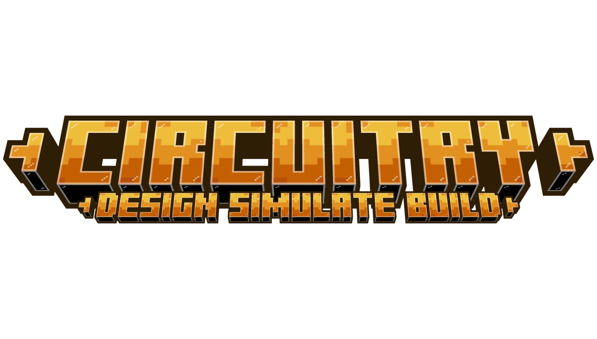

<h1 align="center">
	
	
</h1>

Welcome to Circuitry, a Minecraft mod where electrical imagination has no limits. Circuitry introduces a system of digital and analog electronics inspired by real-world schematics, allowing you to design, connect, and experiment with functional circuits directly in-game.

It includes basic logic gates such as AND, OR, and NOT, as well as compound gates like XOR and more advanced logic elements. You will also find essential electronic components such as inductors, capacitors, voltage sources, ground, batteries, and more.

From simple logic to complex systems, Circuitry allows you to progressively build circuits with the long-term vision of enabling realistic electrical schematics and functional PCB design, all while maintaining a structured and coherent logic foundation.

